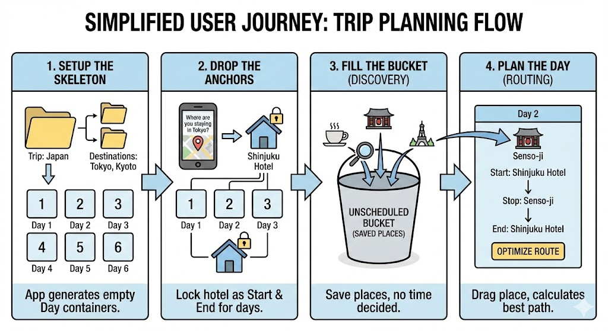
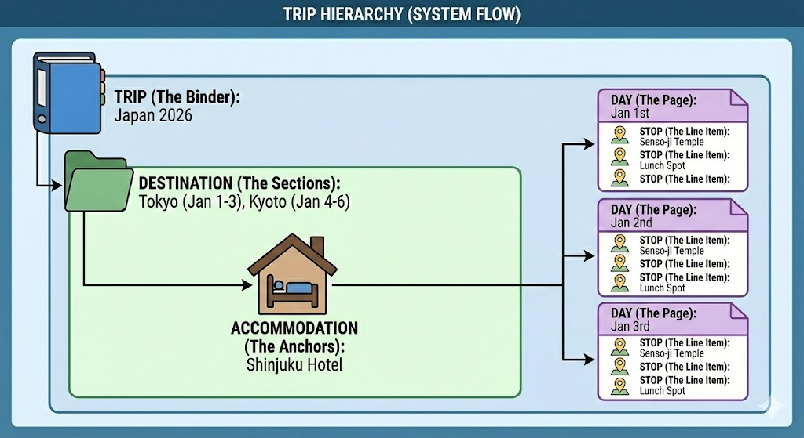

# Vision & Feature Planning - Itinerary Planner

To build a smart itinerary planner that solves the logistics of multi-city travel by organizing trips into destinations and optimizing daily routes based on where the traveler actually sleeps.

## Feature List

### Must Have (MVP)

* **User Authentication (JWT):** Secure login for users.
* **CRUD Trip Management:** Basic create, read, update, delete functionality for trips (e.g., Jan 1-6).
* **Destination Setup:** Ability to define multiple destinations within a single trip (e.g., "Tokyo (Jan 1-3)" → "Kyoto (Jan 4-6)").
* **Accommodation Setup:** Define accommodation for each destination to establish start/end points.
* **Place Search:** Ability to search and save places to a general "Unscheduled Bucket" for the trip.
* **Daily Itinerary Planning:** Drag-and-drop or assign unscheduled places from the bucket to specific days.

### Should Have

* **Smart Route Optimization:** Reorder the stops of a specific day to minimize travel time.
* **Distance Validity Checks:** Soft constraints to warn users if locations are too far apart.

### Nice to Have

* **Share with Others:** Public profile link for a specific trip.
* **Around Me Discovery:** Find saved places near the user's current location.
* **Weather Forecast:** Show the weather for each destination based on its scheduled period.

---

## App Name Ideas

* LegWise
* Itenera
* Legit

---

## Concept Notes

### The User Journey (Usage Flow)

1. **Setup the Skeleton:** The user creates a Trip (e.g., "Japan") and adds Destinations (e.g., "Tokyo" for 3 days, "Kyoto" for 3 days). The app automatically generates 6 empty "Day" containers.
2. **Drop the Anchors:** The app asks, "Where are you staying in Tokyo?" The user selects their hotel. The app locks this hotel as the Start and End point for all 3 days in Tokyo.
3. **Fill the Bucket (Discovery):** The user searches for places (Museums, Cafes) and saves them to a general "Unscheduled Bucket." They don't need to decide *when* to go yet.
4. **Plan the Day (Routing):** The user drags a place from the Bucket into Day 2 and clicks "Optimize Route." The app calculates the best path: Hotel -> Place -> Hotel.

### Trip Hierarchy (System Flow)

* **Trip (The Binder):** The high-level container (e.g., "Japan 2026").
* **Destination (The Sections):** A specific region with a start and end date (e.g., "Tokyo (Jan 1-3)").
* **Accommodation (The Anchors):** The specific place the user sleeps during a Destination; critical for defining where the day starts/ends (e.g., "Shinjuku Hotel").
* **Day (The Page):** A single date within a Destination (e.g., "Jan 2nd").
* **Stop (The Line Item):** A specific attraction or restaurant visited on that day (e.g., "Senso-ji Temple").

